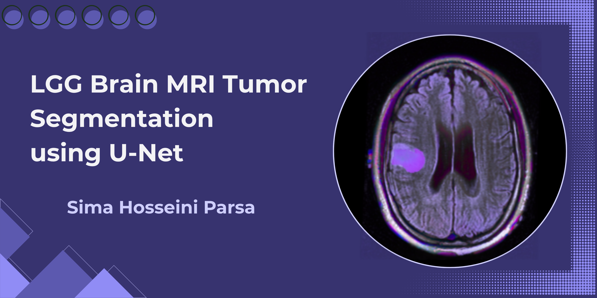
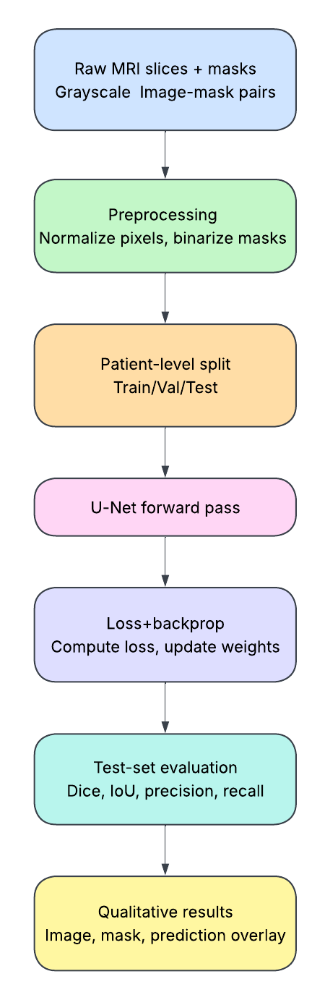
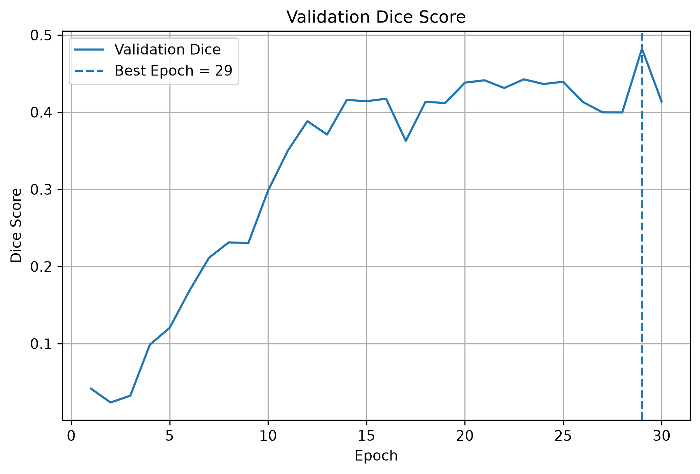
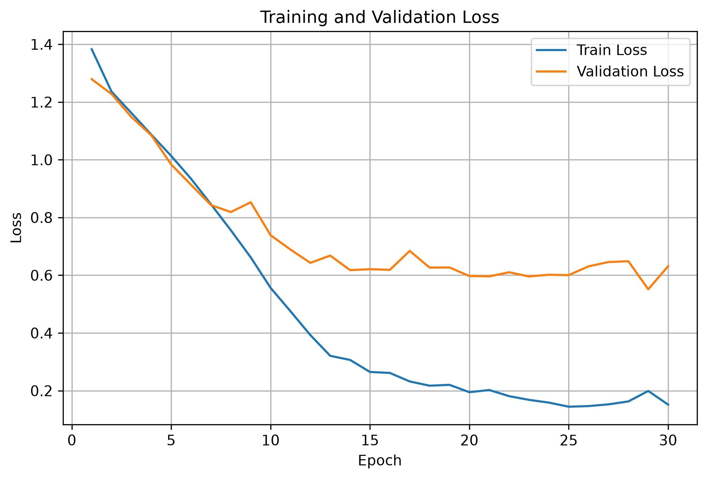
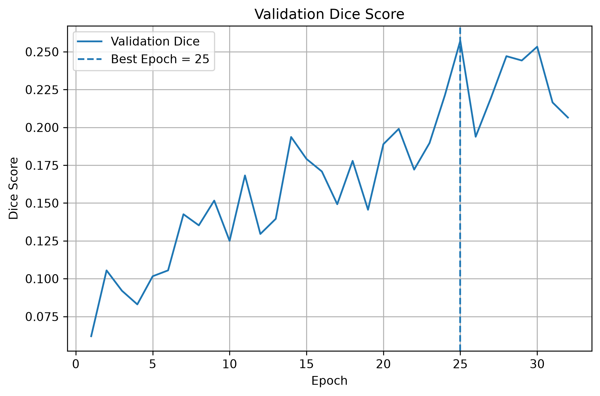
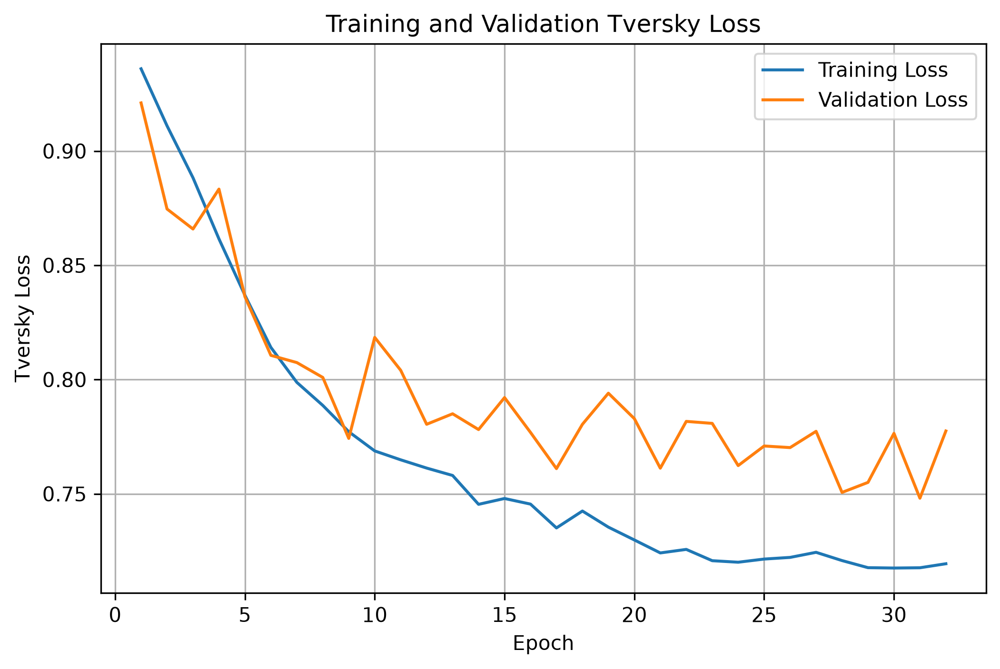
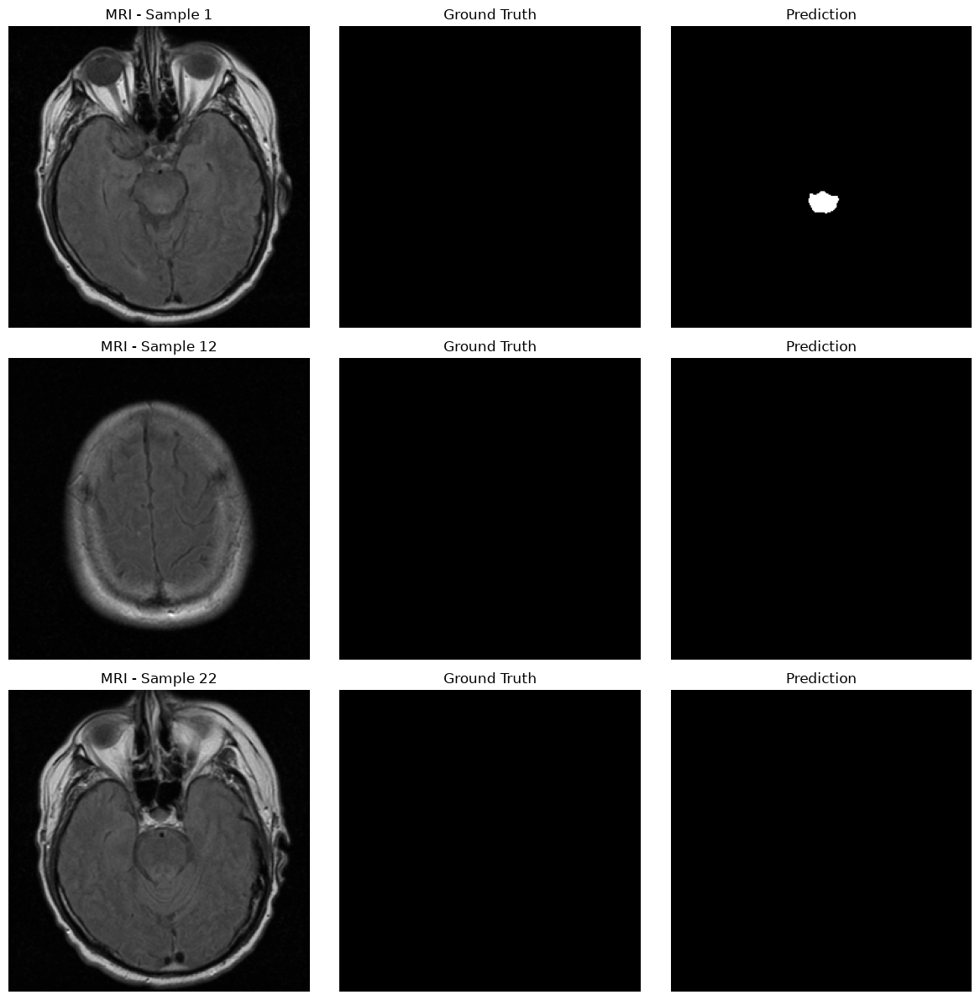

<p align="center">
  
</p>

# LGG-Brain-MRI-Tumor-Segmentation-using-U-Net

A PyTorch-based binary brain tumor segmentation project using the LGG MRI segmentation dataset. The project implements a complete medical image segmentation pipeline, including image-mask verification, patient-level splitting, preprocessing, U-Net training, quantitative evaluation and qualitative analysis.

## Overview

The objective is to segment tumor regions from brain MRI images using a U-Net convolutional neural network.
Two loss-function configurations were investigated:
- **BCE + Dice Loss**
- **Tversky Loss (α = 0.3, β = 0.7)**
Dice Score was used as the primary segmentation metric.

## Key Features

- Patient-level data splitting to avoid patient-level leakage
- Image-mask pairing and verification by filename
- Grayscale MRI preprocessing and binary mask conversion
- U-Net implementation using PyTorch
- Comparison of BCE + Dice Loss and Tversky Loss
- Early stopping and checkpointing during training
- Quantitative evaluation using Dice, IoU, Precision, and Recall
- Qualitative evaluation of segmentation results
  
## Dataset

The project uses the LGG brain MRI segmentation dataset.
| Property |	Value |
|---|---|
| MRI images |	3,929 |
| Segmentation masks	| 3,929 |
| Matched pairs |	3,929 |
| Patients |	110 |
| Image size |	256 × 256 |
| Empty masks |	2,556 |
| Non-empty masks	| 1,373 |

### Patient-Level Split

| Split |	Patients |	Samples |
|---|---|---|
| Train	| 77	| 2,750 |
| Validation |	16 |	618 |
| Test	| 17	| 561 |

Patient IDs were used for splitting to avoid patient-level leakage, and the notebook verifies zero patient overlap between the three subsets.
Image-mask pairs are matched by filename and checked before training.

## Project Pipeline

The overall workflow consists of the following stages:
<p align="center">
  
  </p>

<p align="center">
  Figure 1. Overall pipeline of the Brain MRI Tumor Segmentation
  </p>

## Methodology

### Preprocessing

- Convert MRI images to grayscale
- Normalize image intensities to [0, 1]
- Convert masks from 0/255 to binary 0/1
- Preserve 256 × 256 spatial resolution
- Use one-channel input and one-channel output
  
### U-Net Architecture

The model is implemented using PyTorch and contains:
- Four encoder stages
- Bottleneck
- Four decoder stages
- Max pooling
- Transposed convolutions
- Skip connections
- Batch Normalization
- ReLU activations
- Final 1 × 1 convolution
  
### Loss Functions

**BCE + Dice**
The first experiment uses:
Loss = BCE Loss + Dice Loss
BCE loss evaluates individual pixels, while Dice loss measures the overlap between the predicted and true masks.
**Tversky Loss**
The second experiment uses:
Tversky Loss
with:
- α = 0.3
- β = 0.7
This configuration gives greater weight to false negatives than false positives.
Only this Tversky configuration was tested, so the results should not be interpreted as a comparison against all possible Tversky parameter settings.

## Training Configuration

| Parameter | Setting |
|---|---|
| Model	| U-Net |
| Input size	| 256 × 256 |
| Optimizer	| Adam |
| Learning rate	| 1e-4 |
| Batch size	| 16 |
| Maximum epochs	| 30 |
| Early stopping patience |	7 |
| Random seed	| 42 |
| Device	| CUDA-enabled GPU |

Both experiments use the same dataset split, preprocessing pipeline, architecture, optimizer, and training settings.
The experiments were executed on CUDA-enabled GPU hardware. Due to limited and non-continuous access to suitable GPU computing resources, training was conducted through remote execution and monitoring rather than on a continuously available local GPU system. This constraint limited the number of independent training runs and the extent of hyperparameter experimentation.

## Experiments

### Experiment 1 — BCE + Dice

Best validation performance:
**Validation Dice = 0.4821 at Epoch 29**
This represents the best observed validation performance in this training run. The validation Dice decreased to 0.4137 at epoch 30 while training Dice reached 0.8587.
The decrease at epoch 30 shows that validation performance changed near the end of training. However, because only one training run was performed, it is not possible to determine whether the epoch-29 peak is random noise or a stable improvement.
Final test evaluation:
Dice: **0.7044**
IoU: **0.5492**
Precision: **0.7557**
Recall: **0.6678**

### Experiment 2 — Tversky

Configuration:
**α = 0.3, β = 0.7**
Best validation performance:
**Validation Dice = 0.2573 at Epoch 25**
The validation Dice then changed and reached 0.2533 at epoch 30.
Final test evaluation:
- Dice: **0.2476**
- IoU: **0.1551**
- Precision: **0.1681**
- Recall: **0.6667**
  
## Results

| Experiment	| Best Val Dice	| Test Dice	| Test IoU	| Precision	| Recall |
|---|---|---|---|---|---|
| BCE + Dice	| 0.4821 |	0.7044 |	0.5492 |	0.7557 |	0.6678 |
| Tversky (0.3, 0.7) |	0.2573	| 0.2476 |	0.1551 |	0.1681	| 0.6667 |

Under the tested settings, BCE + Dice performed better overall.
The Tversky configuration produced a similar recall but considerably lower precision, which is consistent with a greater tendency toward false-positive predictions.
The training curves show the changes in validation Dice and loss during training for both experiments. The BCE + Dice experiment achieved higher validation Dice overall, while the Tversky experiment showed lower validation performance.

<p align="center">
  
  </p>

<p align="center">
  Figure 2. Validation Dice curve for the BCE + Dice experiment.
  </p>

  <p align="center">
  
  </p>

<p align="center">
  Figure 3. Training and validation loss curves for the BCE + Dice experiment.
  </p>

  <p align="center">
  
  </p>

<p align="center">
  Figure 4. Validation Dice curve for the Tversky experiment.
  </p>

<p align="center">
  
  </p>

<p align="center">
  Figure 5. Training and validation loss curves for the Tversky experiment.
  </p>
  
## Qualitative Analysis

Representative test samples are visualized using:
- Original MRI
- Ground-truth mask
- Predicted segmentation
  
Visual inspection is used together with quantitative metrics to evaluate the segmentation results and identify errors such as false-positive tumor predictions.

<p align="center">
  
  </p>

<p align="center">
  Figure 6. Qualitative segmentation results on representative test samples using BCE + Dice Loss.
  </p>

## Limitations

- Only one Tversky α/β configuration was evaluated.
- Suitable GPU resources were not continuously available; experiments were executed remotely on CUDA-enabled GPU hardware.
- Training was limited to 30 epochs, which also limited the number of independent training runs and hyperparameter tuning.
- MRI-specific data augmentation was not used.
- Validation performance showed some changes, particularly during the later stages of training.
- The project is a baseline study rather than a fully optimized benchmark.
  
## Future Improvements

Potential improvements include:
- Tuning Tversky α/β parameters
- Data augmentation
- Learning-rate scheduling
- Dropout and weight decay
- Alternative segmentation losses
- Multiple independent training runs
- More detailed patient-level error analysis
- U-Net variants and stronger segmentation architectures
- More computing resources for additional experiments
  
## Project Structure

```text
LGG-Brain-MRI-Tumor-Segmentation-using-U-Net/
│
├── notebooks/
│   ├── U-Net_BCE_Dice.ipynb
│   └── U-Net_Tversky.ipynb
│
├── images/
│   ├── mri_banner.png
│   └── pipeline.png
│
├── results/
│   ├── bce_dice/
│   │   ├── V1_validation_dice.png
│   │   ├── V1_loss_curve.png
│   │   └── bce_dice_test_samples.png
│   │
│   └── tversky/
│       ├── tversky_validation_dice.png
│       ├── tversky_loss_curve.png
│       └── tversky_test_samples.png
│
├── project_report.pdf
├── requirements.txt
└── README.md
```

## Requirements

- Python 3.12
- PyTorch
- NumPy
- Pandas
- Matplotlib
- scikit-learn
- Pillow

## References

1. Buda, M., Saha, A., & Mazurowski, M. A. (2019). Association of genomic subtypes of lower-grade gliomas with shape features automatically extracted by a deep learning algorithm. Computers in Biology and Medicine, 109, 318–328. https://doi.org/10.1016/j.compbiomed.2019.05.002

2. Buda, M. (2019). LGG MRI Segmentation Dataset. Kaggle. Dataset licensed under CC BY-NC-SA 4.0.
